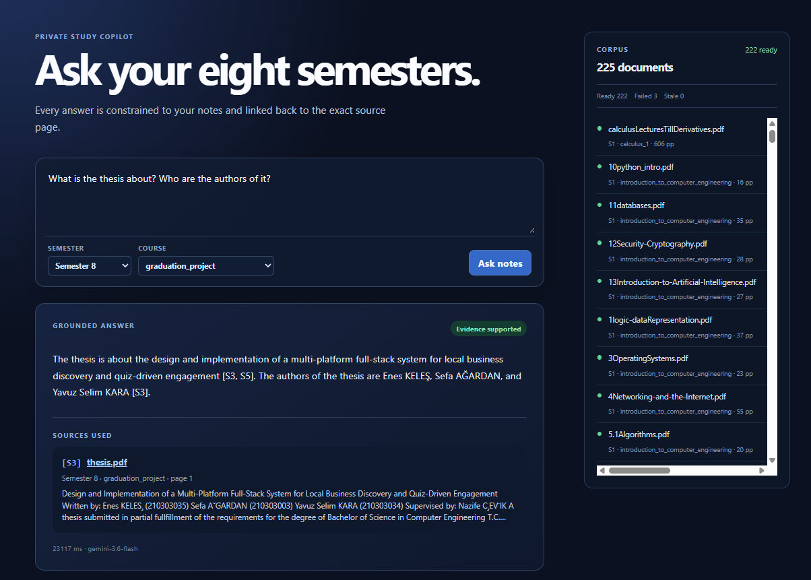
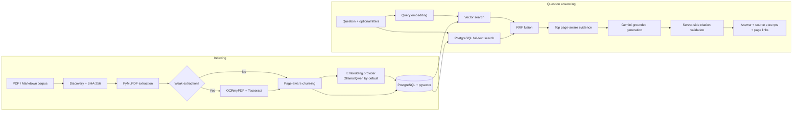

# Lecture Notes RAG

A local-first, citation-first RAG application for asking questions across a private lecture-note corpus. It indexes PDF and Markdown files, retrieves the most relevant passages with hybrid search, and produces answers constrained to that evidence—with links back to the original document and page.



## Why this exists

Lecture notes spread across semesters are difficult to search reliably. This project provides one private study interface that can scope questions by semester or course, expose the evidence used for an answer, and open the cited source at the relevant page.

The source corpus remains on the local filesystem. With the default configuration, document embeddings also run locally through Ollama. Gemini is used only for final grounded answer generation, so it receives the retrieved passages for a question—not the entire corpus.

## Features

- Indexes `.pdf` and `.md` files recursively from `data/`.
- Derives semester and course metadata from `data/semester_N/<course>/...`.
- Extracts page-aware PDF text with PyMuPDF and falls back to OCRmyPDF/Tesseract for weak native extraction when available.
- Skips unchanged files using content hashes and an embedding-aware pipeline version.
- Uses local Ollama/Qwen embeddings by default; Gemini embeddings are an optional alternative.
- Combines pgvector cosine search and PostgreSQL full-text search with Reciprocal Rank Fusion (RRF).
- Filters retrieval by semester, course, or document IDs.
- Generates evidence-constrained answers with inline `[S1]` citations, validates citation labels on the server, and returns canonical page links and excerpts.
- Tracks document state, ingestion progress, failures, conversations, retrieval trace, sources, model, and answer latency in PostgreSQL.
- Prevents vectors from different models or dimensions from being mixed during retrieval.

## RAG architecture



### Ingestion

1. The service discovers supported files under `data/`, hashes them, and reads path-derived metadata.
2. PDFs are extracted page by page; Markdown headings are preserved. PDFs with poor text extraction can be processed through local OCR.
3. Pages are split independently into 700-word chunks with a 90-word overlap, preserving an unambiguous source page for every chunk.
4. Chunks, extraction metadata, and embeddings are stored in PostgreSQL. Existing ready documents are skipped when their hash and pipeline/embedding signature match.
5. Missing source files are marked `stale` rather than deleted from the index.

### Retrieval and grounding

For each question, the backend applies the supplied filters, creates a query embedding, and performs both cosine-distance vector retrieval and PostgreSQL full-text retrieval. The two ranked lists are merged using RRF (`k = 60`). Only chunks matching the active embedding model and dimension are eligible.

The top six passages are labeled by the server as `S1`–`S6` and sent to Gemini with an evidence-only instruction. Gemini must return structured JSON and can cite only those labels. The backend removes unknown citations, requires citations to appear inline, and marks an answer ungrounded if its citation contract cannot be validated. Source names, excerpts, and page URLs always come from the database—not from model output.

## Tech stack

| Layer | Implementation |
| --- | --- |
| Web client | React 19, TypeScript, Vite |
| API | Python 3.12+, FastAPI, Pydantic |
| Database | PostgreSQL 16, pgvector, SQLAlchemy, Alembic |
| Vector retrieval | pgvector HNSW cosine index |
| Lexical retrieval | PostgreSQL `tsvector` + GIN index |
| Local embeddings | Ollama with `qwen3-embedding:0.6b` (1,024 dimensions) |
| Answer generation | Google Gemini, configured by environment |
| Document processing | PyMuPDF; optional OCRmyPDF + Tesseract |
| Local services | Docker Compose |

## Quick start

### Prerequisites

- Docker Desktop
- Python 3.12 or 3.13 and [uv](https://docs.astral.sh/uv/)
- Node.js 22+
- [Ollama](https://ollama.com/) running locally
- A Gemini API key for generated chat answers

### 1. Configure and start dependencies

From the repository root:

```powershell
Copy-Item .env.example .env
ollama pull qwen3-embedding:0.6b
docker compose up -d postgres
```

Set `GEMINI_API_KEY` in `.env`. The default `EMBEDDING_PROVIDER=ollama` keeps embedding requests on your machine; an API key is still required to use the chat endpoint.

### 2. Install and initialize the backend

```powershell
Set-Location backend
uv sync --all-groups
uv run alembic upgrade head
```

### 3. Install the frontend

```powershell
Set-Location ../frontend
npm ci
```

### 4. Run the application

Use two terminals:

```powershell
# Terminal 1 — backend/
uv run uvicorn lecture_notes_rag.main:app --reload --port 8000
```

```powershell
# Terminal 2 — frontend/
npm run dev
```

Open `http://127.0.0.1:5173`, confirm the API is healthy at `http://127.0.0.1:8000/api/v1/health`, then select **Index corpus**. After documents become `ready`, ask a question and inspect the returned sources.

Put notes in the following layout to enable automatic filtering:

```text
data/
├── semester_1/
│   └── calculus/
│       └── limits.pdf
└── semester_3/
    └── data_structures/
        ├── stacks.pdf
        └── trees.md
```

Files outside this pattern are still indexed, but their semester/course metadata is `null`.

## Configuration

Copy `.env.example` to `.env`; never commit `.env` or the private corpus.

| Variable | Default | Purpose |
| --- | --- | --- |
| `GEMINI_API_KEY` | — | Required for Gemini answer generation; accepts `GOOGLE_AI_STUDIO_API_KEY` as a compatibility alias. |
| `GEMINI_GENERATION_MODEL` | `gemini-3.7-flash` | Grounded answer model. |
| `EMBEDDING_PROVIDER` | `ollama` | `ollama` or `gemini`. |
| `OLLAMA_EMBEDDING_MODEL` | `qwen3-embedding:0.6b` | Local embedding model. |
| `EMBEDDING_DIMENSION` | `1024` | Must match the active embedding model. |
| `DATABASE_URL` | local PostgreSQL | SQLAlchemy/PostgreSQL connection string. |
| `CORPUS_ROOT` | `./data` | Source document directory. |
| `RUNTIME_ROOT` | `./runtime` | Disposable local OCR/cache/log artifacts. |

To use Gemini embeddings, set `EMBEDDING_PROVIDER=gemini` and `EMBEDDING_DIMENSION=1536`. Gemini embedding ingestion is rate-limited and may pause safely when quota is exhausted. Any change to the embedding provider, model, or dimension requires a full re-index: the application will not retrieve from a mixed vector space.

> **OCR is optional.** Install OCRmyPDF and Tesseract and ensure they are on `PATH` to process scanned PDFs. Without them, readable native PDF text is still indexed and weak/scanned documents remain visible with their extraction status.

## API

The API is served under `/api/v1`.

| Method | Endpoint | Description |
| --- | --- | --- |
| `GET` | `/health` | API/dependency health and Gemini configuration state. |
| `GET` | `/documents` | Paginated catalog; filter by `semester`, `course`, or `status`. |
| `GET` | `/documents/{id}` | Full document metadata and extraction status. |
| `GET` | `/documents/{id}/content?page=N` | Safely serves the original source file with a page hint. |
| `POST` | `/ingestion/jobs` | Starts an asynchronous, in-process indexing job. Send `{"force": true}` to reprocess all documents. |
| `GET` | `/ingestion/jobs/{id}` | Returns job status and progress counts. |
| `POST` | `/search` | Retrieval-only diagnostic endpoint. |
| `POST` | `/chat` | Returns a grounded answer with citations. |
| `POST` | `/chat/stream` | SSE-compatible stream of the completed grounded answer and sources. |

Example retrieval request:

```powershell
Invoke-RestMethod -Method Post `
  -Uri http://127.0.0.1:8000/api/v1/search `
  -ContentType 'application/json' `
  -Body '{"question":"What is the difference between a process and a thread?", "semester": 3}'
```

## Development and verification

```powershell
Set-Location backend
uv run ruff check .
uv run pytest -q

Set-Location ../frontend
npm run build
```

In local development, ingestion runs inside FastAPI. Stopping the API interrupts an active job; on the next startup, unfinished `queued` or `running` jobs are marked `interrupted`. Starting another non-force job resumes the corpus efficiently because already-ready documents are skipped.

## Repository layout

```text
.
├── backend/                 # FastAPI service, migrations, ingestion and retrieval
├── frontend/                # React study interface
├── data/                    # Private PDF/Markdown source corpus (ignored by Git)
├── runtime/                 # Disposable OCR, cache and log artifacts
├── docs/                    # Local-development guide and implementation plan
├── evals/                   # Evaluation assets and generated reports
├── compose.yaml             # PostgreSQL + pgvector service
└── .env.example             # Safe configuration template
```

## Operational notes

- Treat the contents of `data/` as private/copyrighted material. Confirm you have the right to submit retrieved excerpts to Gemini before enabling generated answers.
- PostgreSQL contains derived text, embeddings, chat history, and citations. Back it up if those records matter; the source corpus itself remains the recovery source of truth.
- This is a single-user, local-first modular monolith. For production or multi-user operation, separate ingestion into a durable worker, add authentication/tenant isolation before shared use, and move source artifacts to managed storage.

## License

This project is released under [CC0 1.0 Universal](LICENSE).
